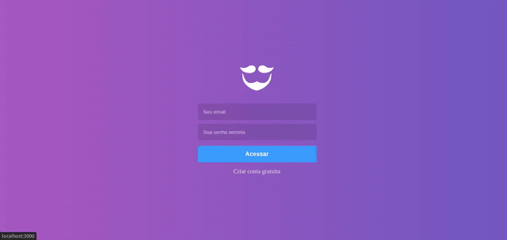

<h1 align="center">
	
</h1>

<h3 align="center">
  <b>Frontend GoBarber</b>
</h3>


<p align="center">
  <a href="#-Sobre-o-projeto">Sobre o projeto</a>&nbsp;&nbsp;&nbsp;|&nbsp;&nbsp;&nbsp;
  <a href="#-Tecnologias">Tecnologias</a>&nbsp;&nbsp;&nbsp;|&nbsp;&nbsp;&nbsp;
  <a href="#-getting-started">Executando o projeto</a>
</p>

<h1 align="center">
	
</h1>


## 💇🏻‍♂️ Sobre o projeto

Esta aplicação em React JS possibilita que os Barbeiros vejam todos os agendamentos e também possibilita a edição do perfil do barbeiro.


Veja também o **backend**, clique aqui: [GoBarber API](https://github.com/jhonicamara/gobarber-api)<br />
Veja também o **mobile**, clique aqui: [GoBarber Mobile](https://github.com/jhonicamara/gobarber-mobile)

## 🚀 Tecnologias

Tecnologias que utilizei para desenvolver este projeto em React JS

- [ReactJS](https://reactjs.org/)
- [React Router DOM](https://reactrouter.com/)
- [React Icons](https://react-icons.netlify.com/#/)
- [UnForm](https://unform.dev/)
- [Yup](https://github.com/jquense/yup)
- [Styled Components](https://styled-components.com/)
- [Polished](https://github.com/styled-components/polished)
- [Axios](https://github.com/axios/axios)
- [Redux](https://redux.js.org/)
- [Redux Saga](https://redux-saga.js.org/)
- [Redux Persist](https://github.com/rt2zz/redux-persist)
- [Immer](https://github.com/immerjs/immer)
- [Reactotron](https://github.com/infinitered/reactotron)
- [Eslint](https://eslint.org/)
- [Prettier](https://prettier.io/)
- [EditorConfig](https://editorconfig.org/)

## 💻 Executando o projeto

### Requisitos

- Ter a [API do GoBarber](https://github.com/jhonicamara/gobarber-api) rodando

**Faça o clone do projeto e acesse a pasta**

```bash
$ git clone https://github.com/jhonicamara/gobarber-web.git gobarber-web && cd gobarber-web
```

**Siga os passos a seguir**

```bash
# Instale as dependências
$ yarn

# Certifique-se que o arquivo src/services/api.js contém o IP da API.

# Inicie o projeto
$ yarn start

# Pronto, projeto executando!
```
---

Feito por João Câmara 👋 [Veja meu Linkedin](https://www.linkedin.com/in/jo%C3%A3o-c%C3%A2mara-565b42184/)
